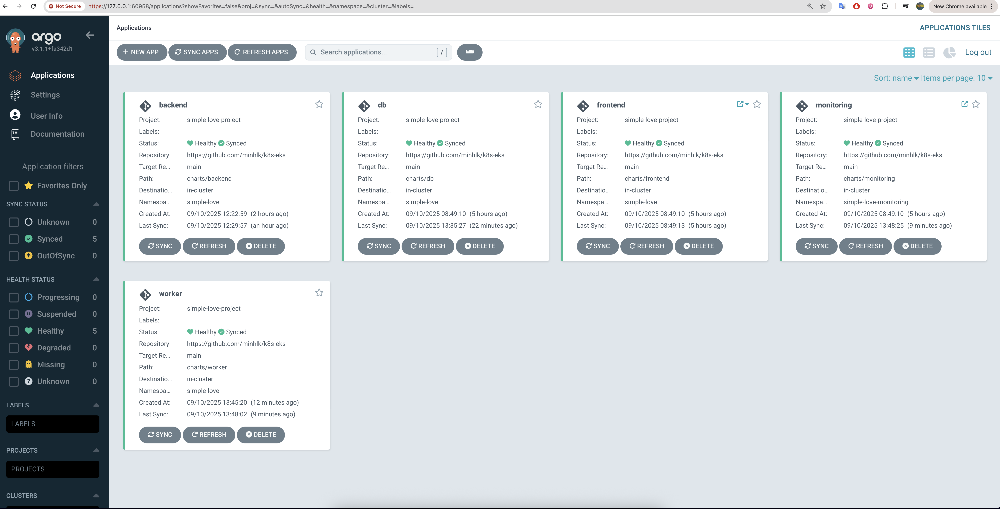

## Introduction
Simple application demonstrate using Kubernetes in AWS with:
- EKS K8s Cluster
- Event Driven Architecture using NATs
- Monitoring and Login using Grafana, Loki, Prometheus through Helm charts.
- Gitops for K8s cluster using ArgoCD

## Prerequisites:

- AWS CLI configured.
- Docker installed.
- Helm installed.
- ArgoCD installed on the cluster.
- `kubectl` installed and configured.
- `eksctl` installed.
- Minikube (locally + metric server + ingress addons are enabled)

## Quick Start
1.  **EKS Cluster Setup**:
- Create EKS cluster through AWS console. 
- Create Node Group or Fargate Profile
- Create Role for cluster, Node Group.
- Create Access entry + policy for `kubectl` to access EKS cluster.

2. **Create the namespace**:
    ```bash
    kubectl apply -f manifests/namespace.yml
    ```

3. **Install ArgoCD**:
    ```bash
    helm install argocd argo/argo-cd --namespace argocd
    ```

4. **Create the ArgoCD Project**:
    ```bash
    kubectl apply -f argocd/simple-love-project.yml
    ```

5. **Deploy to Development**:
   ```bash
   kubectl apply -f argocd/application/dev
   ```

6. **Install NATS for event driven communication**:
   ```bash
    helm repo add nats https://nats-io.github.io/k8s/helm/charts/
    helm repo update
    helm upgrade --install nats nats/nats -n simple-love
   ```

7. **Create local DNS (minikube)**:
    ```host
    # File /etc/hosts
    127.0.0.1 simple-love.com
    127.0.0.1 simple-love-monitoring.com
    ```
    
    ```bash
    #Tunnel minikube cluster to localhost
    minikube tunnel
    ```

## Access 
1. **ArgoCD UI**
    ```bash
    minikube service argocd-server -n argocd
    # Get ArgoCD Password (User: admin)
    kubectl -n argocd get secret argocd-initial-admin-secret -o jsonpath="{.data.password}" | base64 --decode ; echo
    ```
2. **Grafana UI**
    ```bash
    kubectl get secret -n simple-love-monitoring monitoring-grafana -o jsonpath="{.data.admin-password}" | base64 --decode
    https://simple-love-monitoring.com
    ```

## GitOps Workflow

Our GitOps workflow follows these principles:

1. **Git as Single Source of Truth**: All configuration is stored in this repository
2. **Declarative Configuration**: Desired state is declared in YAML files
3. **Automated Synchronization**: ArgoCD ensures the cluster state matches Git
4. **Environment Promotion**: Changes flow from dev → staging → production

## Promotion Strategy

We use Kargo to implement a promotion strategy:

1. **Development**: Automatic deployment of new images
2. **Staging**: WIP
3. **Production**: WIP

## Usage Examples

### View Deployment Status

```bash
kubectl get applications -n argocd
```

### Setup Requirements

1. Add a Docker Hub token as a GitHub secret named `DOCKER_HUB_TOKEN`

2. Customize the workflow in `.github/workflows/main.yml` for additional microservices


## Cleanup:

- Delete the Kubernetes EKS cluster and Helm related resources (ALB...)

## Demo


